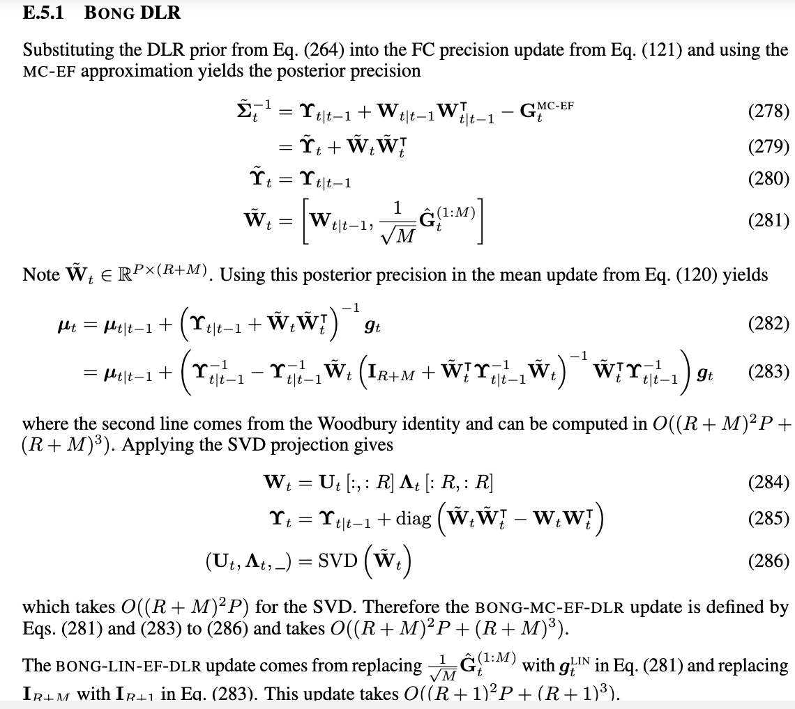
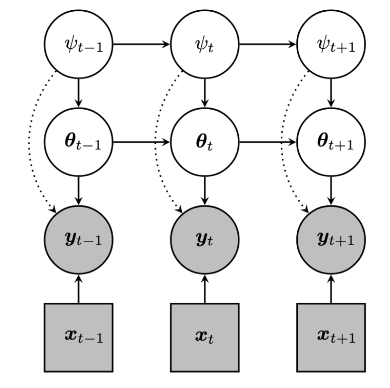
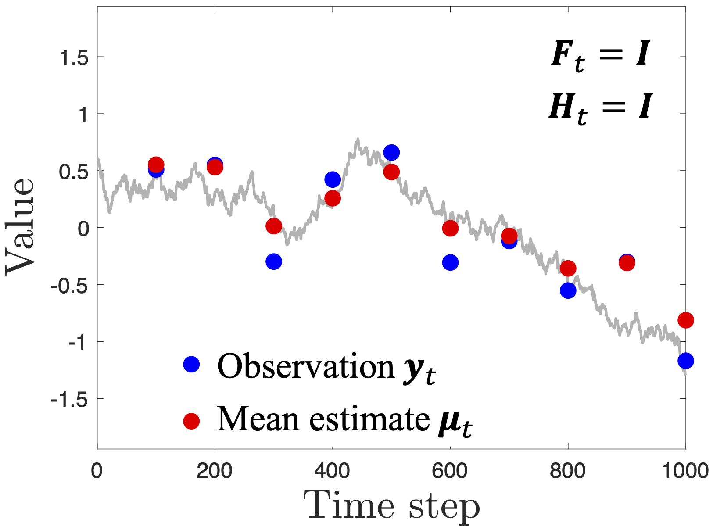
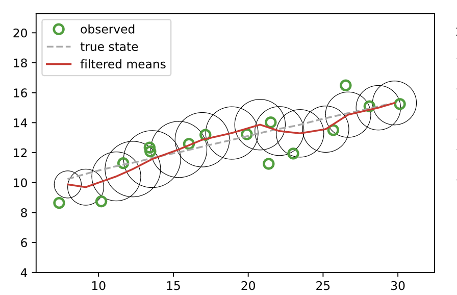

---

## Exponential family distributions

We will consider exponential family variational posteriors with
natural parameters $\psi$,
dual (moment) parameters $\rho$,
sufficient statistics $T(\theta)$,
and log-partition function $\Phi(\psi)$:
$$
\begin{aligned}
q_{\psi}(\psi) &= \exp(\psi^\intercal T(\theta) - \Phi(\psi)) \\
\rho &= E_{\theta \sim q_{\psi}}[T(\theta)]
= \nabla_{\psi} \Phi(\psi)
\end{aligned}
$$

Example: Gaussian distribution
$$
\begin{aligned}
\psi_t^{(1)} &= \Sigma_t^{-1} \mu_t \\
\psi_t^{(2)} &= -\frac{1}{2} \Sigma_t^{-1} \\
\rho_t^{(1)} &= \mu_t \\
\rho_t^{(2)} &= \mu_t \mu_t^\intercal + \Sigma_t
\end{aligned}
$$

---

## Natural Gradient Descent

NGD = preconditioned gradient descent
$$
\begin{aligned}
\psi &:=
\psi + \alpha F_{\psi}^{-1} \nabla_{\psi} L(\psi) 
\end{aligned}
$$
where $F$ is the Fisher information matrix.

For exponential families, we have
$$
\begin{aligned}
F_{\psi} &= \frac{\partial \rho}{\partial \psi} \\
F_{\psi}^{-1} \nabla_{\psi} L(\psi)
 &= \nabla_{\rho} L(\rho)
\end{aligned}
$$

---

## Prior work: BLR and BBB

Bayesian Learning Rule (Khan and Rue, 2023) uses multiple iterations
of natural gradient descent (NGD) on the VI objective
(Evidence Lower Bound).
In the online setting, we get the following
iterative update at each step $t$:
$$
\begin{aligned}
\psi_{t,i} &=
\psi_{t,i-1} + \alpha F_{\psi_{t|t-1}}^{-1}
\nabla_{\psi_{t,i-1}} L_t(\psi_{t,i-1}) \\
&= \psi_{t,i-1} + \alpha 
\nabla_{\rho_{t,i-1}} L_t(\psi_{t,i-1}) \\
 L_t(\psi_{t,i}) &=
    E_{q_{\psi_{t,i}}}[
    \log p(y_{t} \vert h_{t}(\theta_{t}))]
    -KL(q_{\psi_{t,i}} | q_{\psi_{t \vert t-1}})
\end{aligned}
$$

Bayes By Backprop (Blundell et al, 2015)
is similar to BLR but uses GD, not NGD.
$$
\begin{aligned}
\psi_{t,i} &=
\psi_{t,i-1} + \alpha 
\nabla_{\psi_{t,i-1}} L_t(\psi_{t,i-1}) 
\end{aligned}
$$

---

---

## 4 update rules

- (NGD or GD) x (Implicit reg. or KL reg)

$$
\begin{array}{lll} \hline
{\rm Name} & {\rm Loss} & {\rm Update} \\
{\rm BONG} & {\rm E[NLL]} & {\rm NGD} (I=1) \\
{\rm BOG} & {\rm E[NLL]} & {\rm GD} (I=1) \\	
{\rm BLR} & {\rm ELBO} & {\rm NGD (I>1)} \\
{\rm BBB} & {\rm ELBO} & {\rm GD} (I>1) \\	
\end{array}
$$

<!---
---

## LOFI in pictures

{style="max-width: 40%"}
-->

---
layout: two-cols
---

## Hierarchical Bayesian model

Switching State Space Model (SSM).

{style="max-width: 80%"}

::right::

Definitions

$$
x += 1
$$

<!--
---

## KF for denoising 1d signal

$y_t \sim N(\cdot|\theta, \sigma^2)$.

Plot $y_t$ and $E[\theta|y_{1:t}]$  vs $t$

{style="max-width: 50%"}
-->

---

## KF for tracking 2d object

$y_t \sim N(\cdot|\theta^{1:2}, \sigma^2 I)$.

Plot $p(\theta^{1:2}|y_{1:t}]$ for each step $t$.

{style="max-width: 50%"}

---

## Measurement (observation) model

Linear Gaussian model
$$
    p_t(y_t|\theta_t) = N(y_t|H_t \theta_t, R_t)
$$
where $R_t$ is the measurement/ observation noise.

Special case: Linear Regression ($H_t = x_t^\intercal$):
$$
    p(y_t|\theta_t, x_t) = N(y_t|x_t^\intercal \theta_t, R_t)
$$

Binary logistic Regression
$$
    p(y_t|\theta_t, x_t)
    = {\rm Bern}(y_t|\sigma(x_t^\intercal \theta_t))
$$

Multinomial logistic Regression
$$
    p(y_t|\theta_t, x_t)
    = {\rm Cat}(y_t|{\cal S}(\theta_t x_t))
$$

MLP classifier
$$
    p(y_t|\theta_t, x_t) = {\rm Cat}(y_t|{\cal S}
    (\theta_t^{(1)} \text{relu}(\theta_t^{(1)} x_t)))
= {\rm Cat}(y_t|h(\theta_t,x_t))
$$

{style="max-width: 20%"}

---

## BONG framework

- 4 update rules: (NGD or GD) x (Implicit reg. or KL reg)
- 4 gradient computations: (MC or Lin) x (Hess or EF)

$$
\begin{array}{lll} \hline
{\rm Name} & {\rm Loss} & {\rm Update} \\
{\rm BONG} & {\rm E[NLL]} & {\rm NGD} (I=1) \\
{\rm BOG} & {\rm E[NLL]} & {\rm GD} (I=1) \\	
{\rm BLR} & {\rm ELBO} & {\rm NGD (I>1)} \\
{\rm BBB} & {\rm ELBO} & {\rm GD} (I>1) \\	
\end{array}
$$

---

## BONG framework

- 4 update rules: (NGD or GD), (Implicit reg. or KL reg)
- 4 gradient computations: (MC or Lin), (Hess or EF)

{style="max-width: 50%"}

$$
\begin{aligned}
\psi_{t,i} &=
\psi_{t,i-1} + \alpha F_{\psi_{t|t-1}}^{-1}
\nabla_{\psi_{t,i-1}} L_t(\psi_{t,i-1}) \\
&=
\psi_{t,i-1} + \alpha 
\nabla_{\rho_{t,i-1}} L_t(\psi_{t,i-1}) \\
 L_t(\psi_{t,i}) &=
    E_{q_{\psi_{t,i}}}[\log p\left(y_{t} \vert h_{t}(\theta_{t})\right)]
    -KL(q_{\psi_{t,i}} | q_{\vpsi_{t\vert t-1}})
    \end{aligned}
$$

---
## Prediction: Misclassification (plugin) vs sample size (MNIST)

{style="max-width: 75%"}

---
## Calibration: ECE  vs sample size (BBB, BLR, BOG, BONG

{style="max-width: 75%"}

---
## BONG

