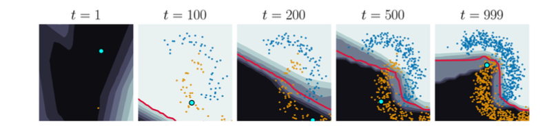
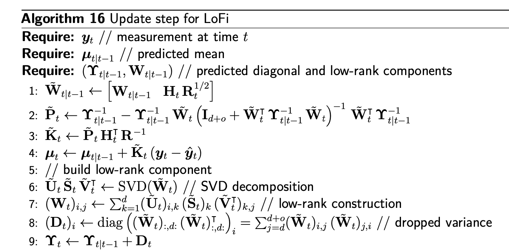

# Generalized Online Variational Bayes for Sequential Decision Making

Kevin Murphy (Google DeepMind)

[khipu.ai](https://khipu.ai/khipu2025/program-2025)

---

# What: Sequential decision making

Observe sequence of past states $s_i$, actions $a_i$ and rewards $r_i$:

$$
    {\cal D}_{1:t-1} = \{(s_1, a_1, r_1), \ldots, (s_{t-1}, a_{t-1}, r_{t-1})\}.
$$

Given new state $s_{t}$ (and past ${\cal D}_{1:t-1})$,
choose action $a_t$  using some decision rule / policy

$$
    \hat{a}_{t} = \pi_{t}(s_{t}, {\cal D}_{1:t-1}).
$$

Receive reward
$$
  r_t = R(s_t, \hat{a}_{t})
$$

Repeat

Goal: (efficiently) update policy $\pi_t$ so as to maximize
the expected sum of rewards, $\sum_t E[r_t]$.

---

# Example: online supervised learning

Observe sequence of features (inputs) $x_i$ and labels (outputs) $y_i$:

$$
    {\cal D}_{1:t-1} = \{(x_1, y_1), \ldots, (x_{t-1}, y_{t-1})\}.
$$

Given new input $x_{t}$ (and past ${\cal D}_{1:t-1})$,
predict the output $y_t$ using some predictor

$$
    \hat{y}_{t} = \pi_{t}(x_{t}, {\cal D}_{1:t-1}).
$$

Incur loss
$$
  \ell_t = \ell(y_t, \hat{y}_{t})
$$

Goal: (efficiently) update predictor $\pi_t$ so as to minimize
the expected sum of losses, $\sum_t E[\ell_t]$.

---

# Online binary classification of 2d inputs

{.centered}

---

# How: Generalized Online Variational Bayes

- Background
  - Bayesian decision theory
  - Online Bayesian inference
  - Variational Bayes
  - Generalized Bayes
- Algorithms 1: low-rank filtering
- Application 1: Bandits
- Application 2: Bayesian optimization
- Algorithms 2: robust filtering 

---

## Bayesian decision theory  101

At each step $t$, pick action that maximizes expected utility /
minimizes expected loss
$$
\begin{aligned}
\hat{a}_t &= \arg \min_a   E[\ell(z_t, a) |  D_{1:t-1}] 
\end{aligned}
$$
where $z_t$ is the unknown "state of nature"
(e.g., class label, parameter),
and $D_{1:t-1}$ is all data available up to decision time

---

## Example: classification

For $\ell_{01}$ loss (classification), optimal estimator
uses posterior mode (MAP estimate)
$$
\begin{aligned}
\hat{y}_t &= \arg \min_a E[\ell_{01}(y_t, a) | x_t, D_{1:t-1}] \\
 &= \arg \min_{a} \sum_{y_t} p(y_t|x_t, D_{1:t-1}) {\cal I}(y_t \neq a) \\
 &= \arg \min_a 1-p(y_t=a|x_t,D_{1:t-1}) \\
 &= \arg \max_{y_t} p(y_t|x_t,D_{1:t-1})
\end{aligned}
$$

For $\ell_{01}$, we assume cost of false positives = cost of false negatives = 1
$$
\begin{array}{c|cc}
 & \hat{y}=0 & \hat{y}=1  \\ \hline
 y=0 & 0 & \ell_{FP}  \\
 y=1 & \ell_{FN} & 0
 \end{array}
$$

---

## Example: regression

For $\ell_2$ loss (regression), optimal estimator
uses posterior mean
$$
\begin{aligned}
\hat{y}_t &= \arg \min_{a} E[\ell_2(y_t, a) | x_t, D_{1:t-1}] \\
 &= \arg \min_{a} \int p(y_t|x_t, D_{1:t-1}) (y_t-a)^2 dy_t \\
 &= E[y_t|x_t,D_{1:t-1}]
\end{aligned}
$$

---

## Online/ Sequential/ Recursive Bayesian inference

State Space Model (SSM)

{style="max-width: 50%" .horizontal-center}

Input: prior belief state $b_{t-1}=p(\theta_{t-1}|D_{1:t-1})$,
where parameters $\theta_{t-1}$ summarize $x_i \rightarrow y_i$

Goal 1: Predict next output $y_t$ given $x_t$ and $D_{1:t-1}$
$$
p(y_t|x_t, D_{1:t-1})= \text{PredictObs}(b_{t-1}, x_t)
$$

Goal 2: update belief state given output $y_t$:
$$
b_t = \text{UpdateBel}(b_{t-1}, x_t, y_t)
$$

---

## Predict-Update cycle

One step ahead  predictive distribution (for unknown $y_t$)
$$
\begin{aligned}
\underbrace{p(\theta_t|D_{1:t-1})}_\text{param. predictive}
 &= b_{t|t-1} = \text{PredictParams}(b_{t-1})
 = \int \underbrace{p(\theta_t|\theta_{t-1})}_\text{dynamics}
 \underbrace{p(\theta_{t-1}|D_{1:t-1})}_\text{previous posterior}
 d\theta_{t-1}
\\
\underbrace{p(y_t|x_t, D_{1:t-1})}_\text{obs. predictive}
&= p_{t|t-1} = \text{PredictObs}(b_{t|t-1}, x_t)
=     \int
    \underbrace{p(y_t | \theta_t, x_{t})}_\text{likelihood}
    \underbrace{p(\theta_t |D_{1:t-1})}_\text{param. predictive}
    d\theta_t
    \end{aligned}
$$

New posterior (after seeing $y_t$):
$$
\begin{aligned}
\overbrace{p(\theta_t|D_{1:t})}^\text{posterior}
&= b_t =
p(\theta_t|x_t,y_t,D_{1:t-1})
= \text{UpdateBel}(b_{t|t-1}, x_t, y_t) \\
&=
\frac{
\overbrace{p(y_t|\theta_t,x_t)}^\text{likelihood}
\overbrace{p(\theta_t|D_{1:t-1})}^\text{prior}}
{
\underbrace{p(y_t|x_t,D_{1:t-1})}_{\text{marg. lik.}}
}
=
\frac{
p(y_t|\theta_t,x_t)
p(\theta_t|D_{1:t-1})}
{\int p(y_t|\theta_t,x_t) p(\theta_t|D_{1:t-1}) d\theta_t}
\end{aligned}
$$

---

##  Gaussian State Space Model (SSM)

{style="max-width: 50%" .horizontal-center}

Measurements  $\bm y_t \in \R^d$ are modelled by an unobserved (latent) state process $\bm\theta_t \in \R^p$:

$$
\begin{aligned}
p(\bm\theta_t \vert  \bm\theta_{t-1}) &= {\cal N}(\bm\theta_t \vert f_t(\bm\theta_{t-1}), {\bf Q}_t),\\
p(\bm y_t \vert \bm\theta_t) &= {\cal N}(\bm y_t \vert h_t(\bm\theta_t), {\bf R}_t).
\end{aligned}
$$

- ${\bf Q}_t$ the state covariance,
- ${\bf R}_t$ the measurement covariance,
- $f_t: \R^p \to \R^p$ the state-transition function, and
- $h_t: \mathbb{R}^p \to \mathbb{R}^d$ the measurement function.

---

## Likelihood model (for the observations)

Linear Gaussian likelihood (with measurement noise cov. $R_t$)
$$
    p_t(y_t|\theta_t) = N(y_t|H_t \theta_t, R_t)
$$

Nonlinear Gaussian likelihood
$$
    p(y_t|\theta_t, x_t) = N(y_t|h(\theta_t, x_t), R_t)
$$

Binary logistic Regression
$$
    p(y_t|\theta_t, x_t)
    = {\rm Bern}(y_t|\sigma(x_t^\intercal \theta_t))
$$

Multinomial logistic Regression
$$
    p(y_t|\theta_t, x_t)
    = {\rm Cat}(y_t|{\cal S}(\theta_t x_t))
$$

MLP classifier
$$
    p(y_t|\theta_t, x_t) = {\rm Cat}(y_t|{\cal S}
    (\theta_t^{(1)} \text{relu}(\theta_t^{(1)} x_t)))
= {\rm Cat}(y_t|h(\theta_t,x_t))
$$

---

## Dynamics model (for the latent parameter)

Linear Gaussian dynamics (with system / process noise cov. $Q_t$)
$$
p(\theta_t | \theta_{t-1}) =
N(\theta_t | F_t  \theta_{t-1} + b_t, Q_t)
$$

Special case of LG: Ornstein-Uhlenbeck process
$$
F_t = \gamma_t I,
b_t = (1-\gamma_t) \mu_0,
Q_t =(1-\gamma_t^2) \Sigma_0
$$

Special case of OU ($\gamma_t=1$): constant parameter
$$
p(\theta_t | \theta_{t-1}) = \delta(\theta_t - \theta_{t-1})
 = N(\theta_t|\theta_{t-1}, 0 I)
$$

Shrink and Perturb (Ash and Adams, 2020):
$$
p(\theta_t | \theta_{t-1}) 
 = N(\theta_t|\theta_{t-1}, Q_t)
$$

---

## Predict step (parameters)

Gaussian ansatz for the previous posterior
$$
p(\theta_{t-1}|D_{1:t-1})
= N(\theta_{t-1}|\mu_{t-1},\Sigma_{t-1})
$$

Previous posterior becomes new prior
$$
\begin{aligned}
p(\theta_t|D_{1:t-1})
 &= \int p(\theta_t|\theta_{t-1})
 p(\theta_{t-1}|D_{1:t-1}) d\theta_{t-1} \\
 &=
 \int N(\theta_t | F_t  \theta_{t-1} + b_t , Q_t)
  N(\theta_{t-1}|\mu_{t-1},\Sigma_{t-1})
  d\theta_{t-1} \\
  &= N(\theta_t|\mu_{t|t-1}, \Sigma_{t|t-1}) \\
\mu_{t|t-1} &= F_t \mu_{t-1} + b_t \\
\Sigma_{t|t-1} &= F_t \Sigma_{t-1} F_t^\intercal + Q_t 
\end{aligned}
$$

Special case for constant parameter ($F_t=I$, $Q_t=0$)
$$
\begin{aligned}
p(\theta_t|D_{1:t-1})
  &= N(\theta_t|\mu_{t-1}, \Sigma_{t-1}) 
\end{aligned}
$$

---

## Predict step (observations)

Prior predictive
$$
\begin{aligned}
p(y_t|x_t,D_{1:t-1})
 &= \int p(y_t|x_t, \theta_t)
 p(\theta_t|D_{1:t-1}) d\theta_{t} 
\end{aligned}
$$
For nonlinear likelihoods, often approximated by Monte Carlo:
$$
\begin{aligned}
p(y_t|x_t,D_{1:t-1})
 &\approx \int p(y_t|x_t,\theta_t)
 \left[ \frac{1}{K} \sum_{k=1}^K \delta(\theta_t-\theta_t^k) \right]
d\theta_t \\
 &\approx \frac{1}{K} \sum_{k=1}^K p(y_t|x_t, \theta_t^k),
\;\; \theta_t^k \sim p(\theta_t|D_{1:t-1})
\end{aligned}
$$
For linear likelihoods, can derive predictive in closed form:
$$
\begin{aligned}
p(y_t|x_t,D_{1:t-1})
 &=N(y_t|H_t \mu_{t|t-1}, \Sigma_{t|t-1} + R_t)
\end{aligned}
$$

---

## Update step

New posterior (after seeing $y_t$):
$$
\underbrace{p(\theta_t|D_{1:t})}_\text{posterior}
\propto
\underbrace{N(y_t|h(\theta_t,x_t), R)}_\text{likelihood}
\underbrace{N(\theta_t|\mu_{t|t-1}, \Sigma_{t|t-1})}_\text{prior}
$$

Focus of this talk: how to compute this posterior efficiently

---

## Kalman filtering

If  we have LG dynamics and LG observations, get closed form solution!

**Predict step**
$$
\begin{aligned}
\bm\Sigma_{t|t-1} &= {\bf F}_t^\intercal\bm\Sigma_{t-1}{\bf F}_t + {\bf Q}_t\\
\bm\mu_{t|t-1} &= {\bf F}_t\bm\mu_{t-1} \\
\hat{\bm y}_t &= {\bf H}_t\bm\mu_{t|t-1}\\
\end{aligned}
$$

**Update step**
$$
\begin{aligned}

{\bf S}_t &= {\bf H}_t\bm\Sigma_{t|t-1}{\bf H}_t^\intercal + {\bf R}_t \\

{\bf K}_t &= \bm\Sigma_{t|t-1}{\bf H}_t^\intercal{\bf S}_t^{-1}\\

\bm\mu_t &=
\bm\mu_{t|t-1} + {\bf K}_t({\bm y}_t - \hat{\bm y}_t)\\

\bm\Sigma_t &=
\bm\Sigma_{t|t-1} - {\bf K}_t{\bf S}_t{\bf K}_t^\intercal
\end{aligned}
$$

---
layout: two-cols
---

## KF for tracking 2d object

{}

::right::

{}

---

## KF for tracking 2d object

---

## KF for online linear regression

$y_t|x_t \sim N(\cdot|\theta^\intercal x_t, \sigma^2)$.

Left: Plot $E[\theta^{1:2}|y_{1:t}]$ vs $t$.
Right: Plot $\sqrt{\frac{1}{t} \sum_{i=1}^t (\hat{y}_{i|1:i-1} - y_i)^2}$ vs $t$

{style="max-width: 70%" .horizontal-center}

---

## KF for online nonlinear regression - how?

$y_t|x_t \sim N(\cdot|h(\theta,  x_t), \sigma^2)$ where $h$ is MLP:

$h(\theta,x_t) = \theta^{(3)}\,\sigma \Big(\theta^{(2)}\,
\sigma \left(\theta^{(1)}{\bf x}_t + b^{(1)}\right) + b^{(2)}\Big) + b^{(3)}$ 

---

## Extended Kalman filter (EKF)
For non-linear state and/or measurement functions.
Replace functions with first-order approximations centred around previous mean.
$$
\begin{aligned}
p(\bm\theta_t \vert  \bm\theta_{t-1}) &= {\cal N}(\bm\theta_t \vert \bar f_t(\bm\theta_{t-1}), {\bf Q}_t)\\
p(\bm y_t \vert \bm\theta_t) &= {\cal N}(\bm y_t \vert \bar h_t(\bm\theta_t), {\bf R}_t) 
\end{aligned}
$$

with

- $\bar f_t(\bm\theta_{t-1}) = f(\bm\mu_{t-1}) + {\bf F}_t(\bm\theta_{t-1} - \bm\mu_{t-1})$,
- $\bar h_t(\bm\theta_t) = h_t(\bm\mu_{t|t-1}) + {\bf H}_t(\bm\theta_t - \bm\mu_{t|t-1})$,
- ${\bf F}_t = \text{Jac}(f_t)(\bm\mu_{t-1})$, ${\bf H}_t = \text{Jac}(h_t)(\bm\mu_{t|t-1})$

---

## Variational inference

Exact posterior
$$
\begin{aligned}
p(\theta|D) =
\frac{1}{p(D)} p_0(\theta) p(D|\theta)) 
\end{aligned}
$$

Approximate posterior: 
$$
\begin{aligned}
q_{\psi^*}(\theta) &\approx p(\theta|D) \\
\psi^*
&= \arg \min_{\psi} KL(q_{\psi}(\theta) | p(\theta|D)) \\
&= \arg\min_{\psi} E_{q_{\psi}(\theta)}\left[ \log q_{\psi}(\theta) -
\log ( \frac{p(\data|\theta) p_0(\theta)}{\cancel{p(\data)}} ) \right] \\
&= \arg\min_{\psi}
\underbrace{E_{q_{\psi}(\theta)}\left[ -\log p(\data|\theta)
- \log p_0(\theta) + \log q_{\psi}(\theta) \right]}_{\text{NELBO}} \\
&= \arg\min_{\psi}
\underbrace{E_{q_{\psi}(\theta)}\left[ -\log p(\data|\theta) \right]}_{\text{ENLL}}
+\underbrace{KL(q_{\psi}(\theta) | p_0(\theta))}_{\text{regularizer}}
\end{aligned}
$$

---

## Variational inference

$$
\begin{aligned}
q_{\psi^*}(\theta) &\approx p(\theta|D) \\
\psi^*
&= \arg\min_{\psi}
\underbrace{E_{q_{\psi}(\theta)}\left[ -\log p(\data|\theta) \right]}_{\text{ENLL}}
+\underbrace{KL(q_{\psi}(\theta) | p_0(\theta))}_{\text{regularizer}}
\end{aligned}
$$

{style="max-width: 50%" .horizontal-center}

---

## Online variational inference

Online version
$$
\begin{aligned}
\psi_t
&= \arg \min_{\psi} L_t^\text{NELBO}(\psi) \\
L_t^\text{NELBO}(\psi) &=
\underbrace{E_{\theta \sim q_{\psi}}
[-\log p(y_t|h_t(\theta_t))]}_\text{incremental E[NLL]}
+
\underbrace{KL(q_\psi | q_{\psi_{t|t-1}})}_\text{incremental
regularizer}
\end{aligned}
$$

---

## Our contributions: faster algorithms for online VI

- "Efficient Online Bayesian Inference for Neural Bandits".  
Gerardo Duran-Martin, Aleyna Kara, Kevin Murphy.  
AISTATS 2022.

-  "Low-rank EKF for online learning of neural
    networks from streaming data'' (LOFI).  
    Peter Chang,  Gerardo Duran-Martin, Alex Shestopaloff, Matt Jones, Kevin Murphy.  
    COLLAS 2023.

- "Bayesian online natural gradient" (BONG).  
Matt Jones, Peter Chang, Kevin Murphy.  
NeurIPS 2024.

- "Low-rank Kalman filtering" (LRKF).  
Gerardo Duran-Martin, Leandro Sánchez-Betancourt, Kevin Murphy.  
(WIP).

---

## Bayes By Backprop (BBB)  1

BBB
uses multiple iterations of gradient descent (GD)
on the ELBO objective:
$$
\begin{aligned}
\psi_{i} &=
\psi_{i-1} + \alpha 
\nabla_{\psi_{i-1}} L^\text{ELBO}(\psi_{i-1}) \\
 L^\text{ELBO}(\psi_{i}) &=
    E_{q_{\psi_{i}}}[
    \log p(\data \vert \theta)]
    -KL(q_{\psi_{i}} | p_{0})
\end{aligned}
$$
It also uses a diagonal Gaussian (mean field) variational posterior,
which is not very expressive.

<Footnotes separator x>
    <Footnote :number=1>
 "Weight Uncertainty in Neural Networks",
 Charles Blundell, Julien Cornebise, Koray Kavukcuoglu, Daan Wierstra,
 ICML 2015.
    </Footnote>
</Footnotes>

---

## Bayesian Learning Rule (BLR) 1

BLR uses multiple iterations
of natural gradient ascent (NGD)  on the ELBO:
$$
\begin{aligned}
\psi_{i} &=
\psi_{i-1} + \alpha F_{\psi_0}^{-1}
\nabla_{\psi_{i-1}} L^\text{ELBO}(\psi_{i-1}) \\
&= \psi_{t,i-1} + \alpha 
\nabla_{\rho_{i-1}} L^\text{ELBO}(\psi_{i-1}) \\
 L^\text{ELBO}(\psi_{i}) &=
    E_{q_{\psi_{i}}}[
    \log p(\data \vert \theta)]
    -KL(q_{\psi_{i}} | p_{0})
\end{aligned}
$$
where the Fisher information matrix is give by
$$
F_{\psi}^{-1} \nabla_{\psi} L(\psi) = \nabla_{\rho} L(\rho)
$$
where $\psi$ are natural parameters and $\rho$
are moment parameters of the exponential family.
For a Gaussian, these are
$$
\begin{aligned}
\rho &= (\mu, \Sigma) \\
\psi &= (\Sigma^{-1} \mu, -\frac{1}{2} \Sigma^{-1})
\end{aligned}
$$

<Footnotes separator x>
    <Footnote :number=1> 
    "The Bayesian Learning Rule",  M. Khan and H. Rue, JMLR 2023
    </Footnote>
</Footnotes>

---

## From online BLR to BONG 1

Online BLR:
$$
\begin{aligned}
\psi_{t,i} &=
\psi_{t,i-1} + \alpha F_{\psi_{t|t-1}}^{-1}
\nabla_{\psi_{t,i-1}} L_t^\text{ELBO}(\psi_{t,i-1}) \\
&= \psi_{t,i-1} + \alpha 
\nabla_{\rho_{t,i-1}} L_t^\text{ELBO}(\psi_{t,i-1}) \\
 L_t^\text{ELBO}(\psi_{t,i}) &=
    E_{q_{\psi_{t,i}}}[
    \log p(y_{t} \vert h_{t}(\theta_{t}))]
    -KL(q_{\psi_{t,i}} | q_{\psi_{t \vert t-1}})
\end{aligned}
$$

In BONG,
we initialize with $\psi_{t,0}=\psi_{t|t-1}$,
and just do one step of gradient ascent (so $i=0$).  
Thus   the KL term vanishes,
but we still have  *implicit regularization* due to initialization
at prior:
$$
\begin{aligned}
 L_t^\text{ELL}(\psi_{t}) &=
    E_{q_{\psi_{t}}}[
    \log p(y_{t} \vert h_{t}(\theta_{t}))]
    -\cancel{KL(q_{\psi_{t}} | q_{\psi_{t \vert t-1}})}
\end{aligned}
$$

Theorem: This is exact in the conjugate case
(eg. Gaussian prior, linear Gaussian likelihood).

<Footnotes separator x>
    <Footnote :number=1>
 "Bayesian online natural gradient".
Matt Jones, Peter Chang, Kevin Murphy.  
NeurIPS 2024.
    </Footnote>
</Footnotes>

---

## BONG vs BLR

{style="max-width: 50%" .centered}

---

## Computing the BONG updates

Recall
$$
\begin{aligned}
\psi_{t} &=
\psi_{t|t-1} + \alpha F_{\psi_{t|t-1}}^{-1}
\nabla_{\psi_{t|t-1}} L_t^\text{ELL}(\psi_{t|t-1}) \\
&= \psi_{t|t-1} + \alpha 
\nabla_{\rho_{t|t-1}} L_t^\text{ELL}(\psi_{t|t-1}) \\
 L_t^\text{ELL}(\psi) &=
    E_{q_{\psi}(\theta_t)}[
    \log p(y_{t} \vert h(x_t, \theta_{t}))]
\end{aligned}
$$
For Gaussian  variational family, this becomes
$$
\begin{aligned}
\mu_t &= \mu_{t|t-1} + \Sigma_t
\underbrace{E_{\theta_t \sim q_{\psi_{t|t-1}}}
[\nabla_{\theta_t} \log p(y_t|h(x_t,\theta_t))]}_{g_t} \\
\Sigma_t^{-1} &= \Sigma_{t|t-1}^{-1} -
\underbrace{E_{\theta_t \sim q_{\psi_{t|t-1}}}[
\nabla^2_{\theta_t} \log p(y_t|h(x_t,\theta_t))]}_{G_t}
\end{aligned}
$$

Key question: how to compute gradient $g_t$ and
Hessian $G_t$?

---

## Computing the gradient

Exact expected gradient
$$
\begin{aligned}
g_t = E_{\theta_t \sim q_{\psi_{t|t-1}}}
[\nabla_{\theta_t} \log p(y_t|h(x_t,\theta_t))]
\end{aligned}
$$

Standard approach: Monte Carlo approximation
$$
\begin{aligned}
g_t^{MC} = \frac{1}{K} \sum_{k=1}^K
\nabla_{\theta_t} \log p(y_t|h(x_t,\theta_t^k)),
\theta_t^k \sim q_{\psi_{t|t-1}}
\end{aligned}
$$

Our approach: linearize the likelihood and compute
expectation deterministically (c.f., EKF)
$$
\begin{aligned}
g_t^{LIN} &= H_t^\intercal R_t^{-1} (y_t-\hat{y}_t) \\
\hat{y}_t &= h(\mu_{t|t-1},x_t) \\
H_t &= \frac{\partial h_t}{\partial \theta_t}|_{\theta_t=\mu_{t|t-1}} \\
R_t &= \text{Var}(y_t|\theta_t=\mu_{t|t-1}) \\
 &= \hat{y}_t (1-\hat{y}_t) // {\rm Bernoulli}
\end{aligned}
$$

---

## Computing the Hessian: second-order approximations

Exact expected Hessian
$$
\begin{aligned}
G_t &= E_{\theta_t \sim q_{\psi_{t|t-1}}}[
\nabla^2_{\theta_t} \log p(y_t|h(x_t,\theta_t))]
\end{aligned}
$$

- MC-Hess: Sample $\theta_t^k$ and plug into Hessian
$$
G_t^{MC-HESS} = \frac{1}{K} \sum_{k=1}^K
\nabla^2_{\theta_t} \log p(y_t|h(x_t,\theta_t^k))]
$$
- Lin-Hess: Linearize and compute Jacobian
$$
G_t^{LIN-HESS} = -H_t^\intercal R_t^{-1} H_t
$$

---

## Computing the Hessian: empirical Fisher approximations

Exact expected Hessian
$$
\begin{aligned}
G_t &= E_{\theta_t \sim q_{\psi_{t|t-1}}}[
\nabla^2_{\theta_t} \log p(y_t|h(x_t,\theta_t))]
\end{aligned}
$$

- EF with MC gradients (BLR):
$$
G_t^{MC-EF} = -g_t^{MC} (g_t^{MC})^\intercal
$$

- EF with linearized gradients (BONG):
$$
G_t^{LIN-EF} = -g_t^{LIN} (g_t^{LIN})^\intercal
$$

---

## Efficient vs Expressive variational posteriors

For the posterior over $\theta_t \in R^P$, we assume
$$
q_{\psi_t}(\theta_t) = N(\theta_t | \mu_t, \Sigma_t)
$$

|Name|Form|Complexity|
|----|----|----------|
Full rank | $(\mu,\Sigma)$ | $O(P^3)$
Diagonal (mean field) | $(\mu,{\rm diag}(\sigma))$ | $O(P)$
LOFI1: Diag + Rank $L$ precision | $(\mu,({\rm diag}(\Upsilon)+W W^{\intercal})^{-1})$ | $O(P L^2)$
LRKF2: Rank $L$ covariance | $(\mu,W W^{\intercal})$ | $O(P L^2)$ 

<Footnotes separator x>
    <Footnote :number=1>
     "Low-rank Filtering",    Chang  et al.     COLLAS 2023.  
    </Footnote>
    <Footnote :number=2>
"Low-Rank Kalman Filtering",
Duran-Martin et al, WIP.
    </Footnote>
</Footnotes>

---

## LOFI (Low-Rank Filtering)

EKF Predict-Update, then SVD projection.
(c.f. Assumed Density Filtering)

{style="max-width: 50%" .horizontal-center}

---
layout: two-cols
---

## LOFI predict step

{}

::right::

## LOFI update step

{}

---

## Example: two moons binary classification

* BONG  (full-rank) for learning 1 layer MLP.

---

## Sample efficiency: Misclassification vs sample size (MNIST)

{style="max-width: 50%" .horizontal-center}

---

## Calibration: ECE  vs sample size 

Expected calibration error

{style="max-width: 75%" .horizontal-center}

----

## Application:  multi-armed bandits

{style="max-width: 30%" .float-left}

$$
    \begin{aligned}
      \arg \max_{a_{1:T}} & \sum_{t=1}^T E[R_{\theta}(a_t)] \\
      	    R_{\theta}(a_t=k) & = \text{reward for taking action $k$ at time $t$}\\
            R_{\theta}(a_t=k) & \sim N(\mu_k, \sigma_k^2) // \text{Gaussian bandit} \\
            R_{\theta}(a_t=k) & \sim {\rm Bern}(\mu_k) // \text{Bernoulli bandit} \\
	    a_t=k & \text{ means show ad $k$, prescribe drug $k$, etc}
    \end{aligned}
$$

----

##  Contextual  Bandits

Now the agent observes a state vector $s_t$ (e.g., web page features,
patient features) at each step,
which influences the reward $r_t$ it obtains for each action
(e.g., ad, drug).
$$
\begin{aligned}
      \arg \max_{\pi_{1:T}} & \sum_{t=1}^T E[R_{\theta}(s_t, \pi_t(s_t))] \\
   R_{\theta}(s_t, a_t=k) & \sim N(w_k^\intercal s_t, \sigma_k^2)
      // \text{linear regression} \\
      R_{\theta}(s_t, a_t=k) & \sim {\rm Bern}(\sigma((w_k^\intercal s_t)))
      // \text{logistic regression}  \\
      R_{\theta}(s_t,a_t=k) &\sim N(h_{\theta}(s_t,k), \sigma^2) 
//      \text{neural bandit}
      \end{aligned}
$$

---

## Exploration-Exploitation Tradeoff

Need to try new actions (explore) to learn about their effects
before exploiting the best action.

{style="max-width: 30%" .horizontal-center}

Action at step $t$ depends on the uncertainty in the belief state $p(\theta|D_{1:t-1})$,
where $D_i = (s_i,a_i,r_i)$ are the observations so far.

---
zoom: 0.8
---

## Upper Confidence Bound (UCB)

$$
\begin{aligned}
 \pi_t(a^* | s_t) &= {\cal I}
 (a^* = \arg \max_{a} \mu_t(a) + c \sigma_t(a) )\\
  \mu_t(a) &= E[R_{\theta}(s_t, a) | D_{1:t-1}] \\
  \sigma_t(a) &= \sqrt{ Var(R_{\theta}(s_t, a) | D_{1:t-1} ) } 
\end{aligned}
$$
Need to recursively update  belief state $p(\theta|D_{1:t-1})$
to implement policy.

{style="max-width: 50%" .horizontal-center}

----

## Thompson Sampling (TS)

$$
\begin{aligned}
  \pi_t(a^*|s_t) &= p(a^* = \arg \max_{a} R_{\theta}(a, s_t) |D_{1:t-1}) \\
  &= \int {\cal I}(a^* = \arg \max_{a} R_{\theta}(a, s_t) )
    p(\theta|D_{1:t-1}) d\theta \\
  &\approx {\cal I}(a^* = \arg \max_{a})
  R_{\tilde{\theta}_t}(a, s_t) ) ,  \;\; \tilde{\theta}_t \sim p(\theta|D_{1:t-1})
    \end{aligned}
$$

Algorithm:
$$
\begin{aligned}
\tilde{\theta}_t &\sim p(\theta|D_{1:t-1}) \\
a_t &= \arg \max_{a}  R_{\tilde{\theta}_t}(a, s_t) 
    \end{aligned}
$$

----

## Bayesian updating for contextual bandits

$$
\begin{aligned}
p(r|s,a;\theta) &= N(r|h(\theta,s),  \sigma^2) // \text{Likelihood} \\
p(\theta|D_{1:t-1}) &= \prod_a N(\theta^a|\mu_{t-1}^a, \Sigma_{t-1}^a) //
\text{Factored prior} \\
p(\theta|D_{1:t}) &= \prod_a N(\theta^a|\mu_{t}^a, \Sigma_{t}^a)
// \text{Factored posterior} \\
(\mu_t^a,\Sigma_t^a)
 &= \text{Update}(\mu_{t-1}^a \Sigma_{t-1}^a, s_t, r_t, a_t)
 // \text{iff $a=a_t$}
\end{aligned}
$$

----

## Contextual bandit shootout (MNIST)1

{style="max-width: 70%" .horizontal-center}

<Footnotes separator x>
    <Footnote :number=1> 
    "Efficient Online Bayesian Inference for Neural Bandits".  Gerardo Duran-Martin, Aleyna Kara, Kevin Murphy. AISTATS 2022.
    </Footnote>
</Footnotes>

----

## Application: Bayesian Optimization

Global, gradient-free optmization of expensive black-box function $f^*(x)$:
$$
\begin{aligned}
x^* = \arg \max_{\theta} f^*(x)
\end{aligned}
$$
where $x \in R^P$ is the input (e.g., hyper-parameters of optimizer,
or inputs to weather simulator).

Equivalent to a MAB with infinite number of arms $x$,
where $f^*$ is the unknown "reward" function.

----

## BayesOpt using Gaussian Process + UCB

We approximate posterior over functions
$p(f|D_{1:t})$ using a Gaussian Process
with  kernel function $K(x,x')$.

Posterior predictive at step $t$:
$$
\begin{aligned}
p(f(x_t)|D_{1:t-1}) &=
N(\cdot | \mu_t(x_t), \sigma_t(x_t)) \\
\mu_t(x_t) &=
k_{t,1:t-1}^\intercal (K_{1:t-1,1:t-1} + \sigma^2 I)^{-1} (y_{1:t-1} - \mu_{1:t-1}) \\
\sigma_t(x_t) &= k_{t,t} - k_{t,1:t}^\intercal
(K_{1:t-1,1:t-1} + \sigma^2 I)^{-1} k_{t,1:t}
\end{aligned}
$$
where $k_{t,1:t-1}=(K(x_t,x_1), \ldots, K(x_t,x_{1:t-1}))$,
and $k_{t,t}=K(x_t,x_t)$.

UCB rule:
$$
x_t = \argmax_x \mu_t(x) + c \sigma_t(x)
$$

----

## BayesOpt in 1d using GP + UCB + exact Bayes

{style="max-width: 50%" .horizontal-center}

---

##  BayesOpt using Thompson Sampling

Instead of using GPs, we would like to use neural networks.
This means
We approximate $f^*$  by $f_{\theta}$,
and need to perform Bayesian inference $p(\theta|D_{1:t-1})$,
using e.g., BONG.

Once we have the posterior,
we sample parameters from it, plug them into the function,
and then find its maximum (using gradient-based methods):
$$
\begin{aligned}
\tilde{\theta}_t &\sim p(\theta|D_{1:t-1}) \\
x_t &= \arg \max_{x}  f_{\tilde{\theta}_t}(x) \\
D_t &= (x_t, f^*(x_t)) \\
p(\theta|D_{1:t}) &= \text{UpdateBel}(p(\theta|D_{1:t-1}),  D_t)
    \end{aligned}
$$

----

## BayesOpt in 1d using MLP + TS + LRKF 1

{style="max-width: 70%" .horizontal-center}

<Footnotes separator x>
    <Footnote :number=1>
"Low-Rank Kalman Filtering",
Duran-Martin et al, WIP.
    </Footnote>
</Footnotes>

---

# Robustifying  KF-like methods (BONG, etc)

Standard (variational) Bayes is sensitive to outliers and misspecified measurement models

---

## Example: 2d Tracking problem

Measurements sampled from a Student-t distribution with 2.01 degrees of freedom.

---

## Example: Sequential training of non-linear models

Any measurement has 15% probability of taking value between -50 and 50.

---

# Generalized Variational Bayesian inference 1

VI
$$
\begin{aligned}
\psi^*
&= \arg\min_{\psi}
\underbrace{E_{q_{\psi}(\theta)}\left[ -\log p(\data|\theta) \right]}_{\text{ENLL}}
+\underbrace{KL(q_{\psi}(\theta) | p_0(\theta))}_{\text{regularizer}}
\end{aligned}
$$

GVI
$$
\begin{aligned}
\psi^*
&= \arg\min_{\psi}
\underbrace{E_{q_{\psi}(\theta)}\left[ \ell(\theta|\data) \right]}_{\text{loss}}
+\underbrace{D(q_{\psi}(\theta) | p_0(\theta))}_{\text{divergence}}
\end{aligned}
$$

<Footnotes separator x>
    <Footnote :number=1>
   "An Optimization-centric View on Bayes' Rule:
   Reviewing and Generalizing Variational Inference".
     Jeremias Knoblauch et al.
     JMLR 2021.
    </Footnote>
</Footnotes>

---

# The weighted likelihood filter (WoLF)

"Outlier-robust Kalman filtering through generalised Bayes".  
Gerardo Duran-Martin, Matias Altamirano, Alexander Y Shestopaloff, Leandro Sanchez Betancourt, Jeremias Knoblauch, Matt Jones, François-Xavier Briol, Kevin Murphy.
ICML 2024.

Replace the log likelihood
$\log {\cal N}(\bm y_t \vert h_t(\bm\theta_t), {\bf R}_t)$
with loss function of the form
$$
\begin{aligned}
\ell_t(\theta_t) &= -W_t(\bm y_{1:t})\,
\log{\cal N}(\bm y_t \vert h_t(\bm\theta_t), {\bf R}_t).
\end{aligned}
$$
Easy to modify KF-like methods, as we will show.

---

## WoLF for Gaussian SSMs

For an LG-SSM, WoLF updates step is a simple modification of the KF update step.

$$
\begin{aligned}
\hat{\bm y}_t &= {\bf H}_t\bm\mu_{t|t-1}\\

{\bf S}_t &= 

{\bf H}_t\bm\Sigma_{t|t-1}{\bf H}_t^\intercal + {\bf R}_t
{\color{red}
/ W_t(\bm y_{1:t})} \\

{\bf K} &= \bm\Sigma_{t|t-1}{\bf H}_t^\intercal{\bf S}_t^{-1}\\

\bm\mu_t &=
\bm\mu_{t|t-1} + {\bf K}_t({\bm y}_t - \hat{\bm y}_t)\\

\bm\Sigma_t &=
\bm\Sigma_{t|t-1} - {\bf K}_t{\bf S}_t{\bf K}_t^\intercal
\end{aligned}
$$

Can easily be generalized to EKF, BONG, etc.

---

## Our choice of weighting function: the IMQ

Inverse multi-quadratic

$$
W_t({\bm y}_{1:t}) = \left(1 + \frac{\|\bm y_t - \hat{\bm y}_t\|_2^2}{c^2}\right)^{-1/2}
$$
with $c > 0$ the soft-threshold.

Downweight "unlikely" observations, to avoid overcompensating.

Provably robust --- can bound the posterior influence function (see paper).

---

## Example: 2d-tracking problem

---

## Example:  Sequential training of neural networks

---

### Comparison to alternative methods
Online training of neural networks in corrupted UCI datasets.

<figure>

<figcaption>
     Results are shown relative to online gradient descent (OGD) with multiple inner iterations.
</figcaption>
</figure>

    
---

## Summary and future work

- Sequential Bayesian inference has many applications,
e.g., online learning, bandits, Bayes Opt.

- We propose new efficient  (and deterministic) algorithms
based on recursive (generalized)
variational inference and (low rank) Gaussian approximations.

- Future work: scale up to large neural networks,
and applications to RL.
