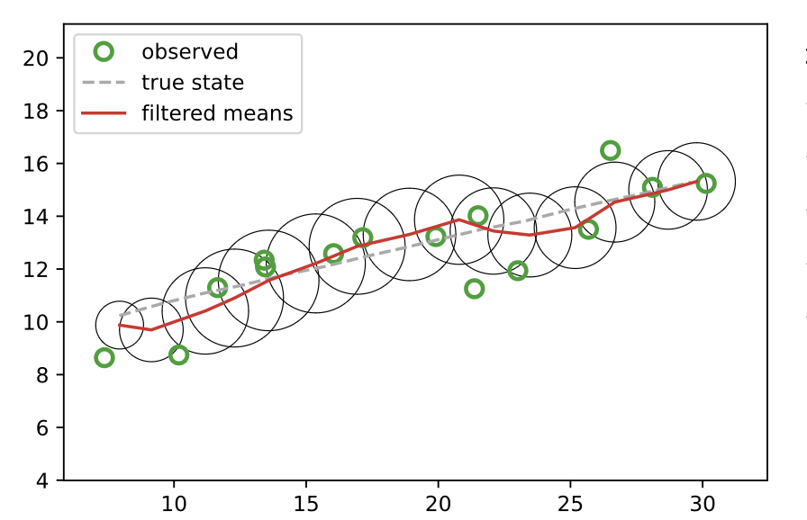
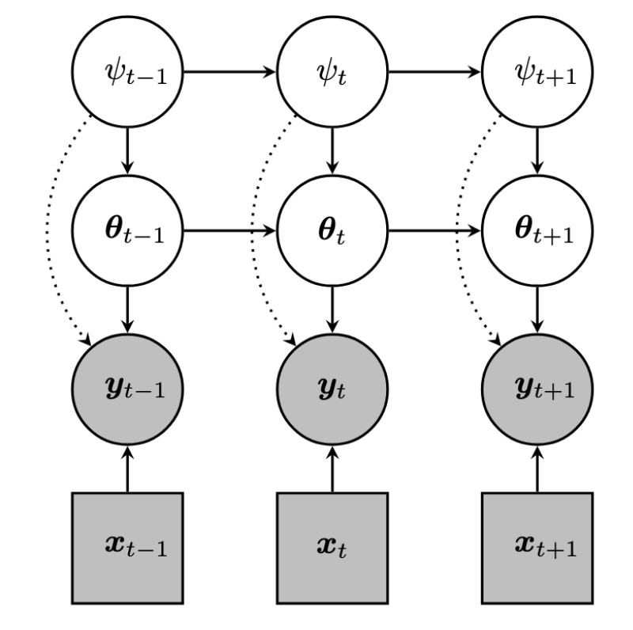

# Generalized Online Variational Bayes for Sequential Decision Making

Kevin Murphy (Google DeepMind)

Joint work with: Gerardo Duran-Martin (QMU), Alexander Shestopaloff (QMU),
Leandro Sánchez-Betancourt (OMI), Peter Chang (MIT), Matt Jones (U. Colorado)

[khipu.ai](https://khipu.ai/khipu2025/program-2025)

---

# Sequential online learning and prediction

Observe sequence of features $x_i$ and observations $y_i$:

$$
    {\cal D}_{1:t-1} = \{(x_1, y_1), \ldots, (x_{t-1}, y_{t-1})\}.
$$

Given new input $x_{t}$ (and past ${\cal D}_{1:t-1})$,
predict the output $y_t$ using some decision rule

$$
    \hat{y}_{t} = \pi_{t}(x_{t}, {\cal D}_{1:t-1}).
$$

Incur loss
$$
  \ell_t = {\cal L}(y_t, \hat{y}_{t})
$$

Repeat

Goal: (efficiently) update predictor/policy $\pi_t$ so as to minimize
the expected sum of losses, $\sum_t E[\ell_t]$.

---

## Example: Sequential binary classification

{.centered}

---

## Outline

- Background
- BONG/ LOFI
- Bandits
- BONE

---

## Optimal prediction using Bayesian decision theory 

For $\ell_2$ loss (regression), use posterior mean
$$
\begin{aligned}
\hat{y}_t &= \arg \min_{a} E[\ell_2(y_t, a) | x_t, D_{1:t-1}] \\
 &= \arg \min_{a} \int p(y_t|x_t, D_{1:t-1}) (y_t-a)^2 dy_t \\
 &= E[y_t|x_t,D_{1:t-1}]
\end{aligned}
$$

For $\ell_{01}$ loss (classification), use posterior mode
$$
\begin{aligned}
\hat{y}_t &= \arg \min_a E[\ell_{01}(y_t, a) | x_t, D_{1:t-1}] \\
 &= \arg \min_{a} \sum_{y_t} p(y_t|x_t, D_{1:t-1}) {\cal I}(y_t \neq a) \\
 &= \arg \min_a 1-p(y_t=a|x_t,D_{1:t-1}) \\
 &= \arg \max_{y_t} p(y_t|x_t,D_{1:t-1})
\end{aligned}
$$

In general,  $\hat{y}_t = f(p(y_t|x_t, D_{1:t-1}))$

---

## Generative model

Optimal predictor: $\hat{y}_t = f(p(y_t|x_t, D_{1:t-1}))$

Use parametric model $p(y_t|x_t,\theta_t)$
where $\theta_t$ summarizes $D_{1:t-1}$.

{style="max-width: 50%" .horizontal-center}

---

## Sequential Bayesian inference

One step ahead  predictive distribution (for unknown $y_t$)
$$
\begin{aligned}
\underbrace{p(\theta_t|D_{1:t-1})}_\text{param. predictive}
 &= \int \underbrace{p(\theta_t|\theta_{t-1})}_\text{dynamics}
 \underbrace{p(\theta_{t-1}|D_{1:t-1})}_\text{previous posterior}
 d\theta_{t-1}
\\
\underbrace{p(y_t|x_t, D_{1:t-1})}_\text{obs. predictive}
&=
     \int
    \underbrace{p(y_t | \theta_t, x_{t})}_\text{likelihood}
    \underbrace{p(\theta_t |D_{1:t-1})}_\text{param. predictive}
    d\theta_t
    \end{aligned}
$$

New posterior (after seeing $y_t$):
$$
\begin{aligned}
\overbrace{p(\theta_t|D_{1:t})}^\text{posterior}
&=
p(\theta_t|x_t,y_t,D_{1:t-1})
=\frac{
\overbrace{p(y_t|\theta_t,x_t)}^\text{likelihood}
\overbrace{p(\theta_t|D_{1:t-1})}^\text{prior}}
{p(y_t|x_t,D_{1:t-1})} \\
\overbrace{p(y_t|x_t,D_{1:t-1})}^\text{marg. likelihood} &=
\int p(y_t|\theta_t,x_t) p(\theta_t|D_{1:t-1}) d\theta_t
\end{aligned}
$$

---

## Measurement (observation) model

Linear Gaussian model (with measurement noise cov. $R_t$)
$$
    p_t(y_t|\theta_t) = N(y_t|H_t \theta_t, R_t)
$$

Special case: Linear Regression ($H_t = x_t^\intercal$):
$$
    p(y_t|\theta_t, x_t) = N(y_t|x_t^\intercal \theta_t, R_t)
$$

Binary logistic Regression
$$
    p(y_t|\theta_t, x_t)
    = {\rm Bern}(y_t|\sigma(x_t^\intercal \theta_t))
$$

Multinomial logistic Regression
$$
    p(y_t|\theta_t, x_t)
    = {\rm Cat}(y_t|{\cal S}(\theta_t x_t))
$$

MLP classifier
$$
    p(y_t|\theta_t, x_t) = {\rm Cat}(y_t|{\cal S}
    (\theta_t^{(1)} \text{relu}(\theta_t^{(1)} x_t)))
= {\rm Cat}(y_t|h(\theta_t,x_t))
$$

---

## Dynamics model (for the latent parameter)

Linear Gaussian dynamics (with system / process noise cov. $Q_t$)
$$
p(\theta_t | \theta_{t-1}) =
N(\theta_t | F_t  \theta_{t-1} + b_t, Q_t)
$$

Special case of LG: Ornstein-Uhlenbeck process
$$
F_t = \gamma_t I,
b_t = (1-\gamma_t) \mu_0,
Q_t =(1-\gamma_t^2) \Sigma_0
$$

Special case of OU ($\gamma_t=1$): constant parameter
$$
p(\theta_t | \theta_{t-1}) = \delta(\theta_t - \theta_{t-1})
 = N(\theta_t|\theta_{t-1}, 0 I)
$$

Shrink and Perturb (Ash and Adams, 2020):
$$
p(\theta_t | \theta_{t-1}) 
 = N(\theta_t|\theta_{t-1}, Q_t)
$$

---

## Turning the Bayesian crank: Predict step

Gaussian ansatz
$$
p(\theta_{t-1}|D_{1:t-1})
= N(\theta_{t-1}|\mu_{t-1},\Sigma_{t-1})
$$

Compute prior from previous posterior
$$
\begin{aligned}
p(\theta_t|D_{1:t-1})
 &= \int p(\theta_t|\theta_{t-1})
 p(\theta_{t-1}|D_{1:t-1}) d\theta_{t-1} \\
 &=
 \int N(\theta_t | F_t  \theta_{t-1} + b_t , Q_t)
  N(\theta_{t-1}|\mu_{t-1},\Sigma_{t-1})
  d\theta_{t-1} \\
  &= N(\theta_t|\mu_{t|t-1}, \Sigma_{t|t-1}) \\
\mu_{t|t-1} &= F_t \mu_{t-1} + b_t \\
\Sigma_{t|t-1} &= F_t \Sigma_{t-1} F_t^\intercal + Q_t 
\end{aligned}
$$

Special case for constant parameter ($F_t=I$, $Q_t=0$)
$$
\begin{aligned}
p(\theta_t|D_{1:t-1})
  &= N(\theta_t|\mu_{t-1}, \Sigma_{t-1}) 
\end{aligned}
$$

---

## Turning the Bayesian crank: Update step

New posterior (after seeing $y_t$):
$$
\underbrace{p(\theta_t|D_{1:t})}_\text{posterior}
\propto
\underbrace{N(y_t|h(\theta_t,x_t), R)}_\text{likelihood}
\underbrace{N(\theta_t|\mu_{t|t-1}, \Sigma_{t|t-1})}_\text{prior}
$$

Focus of this talk: how to compute this posterior efficiently

---

## Kalman filtering

If  we have LG dynamics and LG observations, get closed form solution!

Predict step:
$$
\begin{aligned}
p(\theta_t|D_{1:t-1})
  &= N(\theta_t|\mu_{t|t-1}, \Sigma_{t|t-1}) \\
\mu_{t|t-1} &= F_t \mu_{t-1} + b_t \\
\Sigma_{t|t-1} &= F_t \Sigma_{t-1} F_t^\intercal + Q_t 
\end{aligned}
$$

Update step:
$$
\begin{aligned}
p(\theta_t|D_{1:t})  &= N(\theta_t|\mu_{t}, \Sigma_{t}) \\
\Sigma_{t}^{-1} &= \Sigma_{t|t-1}^{-1} + H_t^\intercal R_t^{-1} H_t \\
\mu_{t|t-1} &= \mu_{t|t-1} + K_t(y_t - \hat{y}_t) \\
\hat{y}_t &= h(\mu_{t|t-1},x_t) = H_t \mu_{t|t-1} \\
K_t &= \Sigma_t H_t R_t^{-1}
\end{aligned}
$$

---

## KF for tracking 2d object

{style="max-width: 70%" .centered}

---

## KF for tracking 2d object

$y_t \sim N(\cdot|\theta^{1:2}, \sigma^2 I)$.

Plot $y_t$ and $p(\theta^{1:2}|y_{1:t})$ for each step $t$.

{style="max-width: 30%" .centered}

---

## KF for online linear regression

$y_t|x_t \sim N(\cdot|\theta^\intercal x_t, \sigma^2)$.

Left: Plot $E[\theta^{1:2}|y_{1:t}]$ vs $t$.
Right: Plot $\sqrt{\frac{1}{t} \sum_{i=1}^t (\hat{y}_{i|1:i-1} - y_i)^2}$ vs $t$

{style="max-width: 70%" .horizontal-center}

---

## General case: use variational infernece

Batch version: Minimize KL from true posterior $p(\theta|D)$
to approximate posterior $q_{\psi}(\theta)$
$$
\begin{aligned}
\psi &= \arg \min_{\psi} KL(q_{\psi}(\theta) |
\frac{1}{Z} p_0(\theta) p(D|\theta)) \\
&= \arg \max_{\psi} L^\text{ELBO}(\psi) + \text{const} \\
L^\text{ELBO}(\psi) &=
\underbrace{E_{\theta \sim q_{\psi}}
[\log p(D|\theta)]}_\text{ELL}
-
\underbrace{KL(q_\psi | p_0)}_\text{regularizer}
\end{aligned}
$$
where $L^\text{ELBO}$ is evidence lower bound.

Online version
$$
\begin{aligned}
\psi_t
&= \arg \max_{\psi} L_t^\text{ELBO}(\psi) \\
L_t^\text{ELBO}(\psi) &=
\underbrace{E_{\theta \sim q_{\psi}}
[-\log p(y_t|h_t(\theta_t))]}_\text{incremental E[NLL]}
+
\underbrace{KL(q_\psi | q_{\psi_{t|t-1}})}_\text{recursive
regularizer}
\end{aligned}
$$

---

## Our approach: BONG and LOFI

- "Bayesian online natural gradient" (BONG).
Matt Jones, Peter Chang, Kevin Murphy.
NeurIPS 2024.

-  "Low-rank extended Kalman filtering for online learning of neural
    networks from streaming data'' (LOFI).
    Peter Chang,  Gerardo Duran-Martin, Alex Shestopaloff, Matt Jones, Kevin Murphy.
    COLLAS 2023.

Contributions:
- C1. Simplified one-step version of Bayesian Learning Rule (Khan and Rue, 2023).
- C2. Faster (deterministic) way to compute (the gradient of) the objective.
- C3. Faster diagonal plus low-rank (DLR) variational posterior (LOFI).
- C4. Unifying framework (and experimental comparison)
    for many previous methods.

---

## C1. From BLR to BONG

BLR uses multiple iterations
of natural gradient ascent (NGD)  on the ELBO:
$$
\begin{aligned}
\psi_{t,i} &=
\psi_{t,i-1} + \alpha F_{\psi_{t|t-1}}^{-1}
\nabla_{\psi_{t,i-1}} L_t^\text{ELBO}(\psi_{t,i-1}) \\
&= \psi_{t,i-1} + \alpha 
\nabla_{\rho_{t,i-1}} L_t^\text{ELBO}(\psi_{t,i-1}) \\
 L_t^\text{ELBO}(\psi_{t,i}) &=
    E_{q_{\psi_{t,i}}}[
    \log p(y_{t} \vert h_{t}(\theta_{t}))]
    -KL(q_{\psi_{t,i}} | q_{\psi_{t \vert t-1}})
\end{aligned}
$$
where $\psi$ are natural parameters and $\rho$
are moment parameters.
(Recall that
$F_{\psi}^{-1} \nabla_{\psi} L(\psi) = \nabla_{\rho} L(\rho)$.)

In BONG,
we initialize with $\psi_{t,0}=\psi_{t|t-1}$,
and just do one step,
so  the KL term vanishes,
but we still have  implicit regularization due to initialization
at prior:
$$
\begin{aligned}
 L_t^\text{ELL}(\psi_{t}) &=
    E_{q_{\psi_{t}}}[
    \log p(y_{t} \vert h_{t}(\theta_{t}))]
    -\cancel{KL(q_{\psi_{t}} | q_{\psi_{t \vert t-1}})}
\end{aligned}
$$

Theorem: This is exact in the conjugate case
(eg. Gaussian prior, linear Gaussian likelihood).

---

## BONG vs BLR

{style="max-width: 50%" .centered}

---

## BONG vs BBB

Bayes By Backprop (Blundell et al, 2015)
is similar to BLR
but uses GD (not NGD) on the ELBO objective:
$$
\begin{aligned}
\psi_{t,i} &=
\psi_{t,i-1} + \alpha 
\nabla_{\psi_{t,i-1}} L_t^\text{ELBO}(\psi_{t,i-1}) 
\end{aligned}
$$

By contrast, BONG uses NGD and ELL objective.

We also define "BOG" (Bayesian Online Gradient)
variant of BONG which uses GD (not NGD) on E[LL] objective.
$$
\begin{aligned}
\psi_{t,i} &=
\psi_{t,i-1} + \alpha 
\nabla_{\psi_{t,i-1}} L_t^\text{ELL}(\psi_{t,i-1}) 
\end{aligned}
$$

---

## C2. Faster update

Generic update rule for Gaussian variational family
$$
\begin{aligned}
\mu_t &= \mu_{t|t-1} + \Sigma_t
\underbrace{E_{\theta_t \sim q_{\psi_{t|t-1}}}
[\nabla_{\theta_t} \log p(y_t|h(x_t,\theta_t))]}_{g_t} \\
\Sigma_t^{-1} &= \Sigma_{t|t-1}^{-1} -
\underbrace{E_{\theta_t \sim q_{\psi_{t|t-1}}}[
\nabla^2_{\theta_t} \log p(y_t|h(x_t,\theta_t))]}_{G_t}
\end{aligned}
$$

Key question: how to compute gradient $g_t$ and
Hessian $G_t$?

---

## Computing the gradient

Exact expected gradient
$$
\begin{aligned}
g_t = E_{\theta_t \sim q_{\psi_{t|t-1}}}
[\nabla_{\theta_t} \log p(y_t|h(x_t,\theta_t))]
\end{aligned}
$$

Standard approach: Monte Carlo approximation
$$
\begin{aligned}
g_t^{MC} = \frac{1}{K} \sum_{k=1}^K
\nabla_{\theta_t} \log p(y_t|h(x_t,\theta_t^k)),
\theta_t^k \sim q_{\psi_{t|t-1}}
\end{aligned}
$$

Our approach: linearize the likelihood and compute
expectation deterministically (c.f., EKF)
$$
\begin{aligned}
g_t^{LIN} &= H_t^\intercal R_t^{-1} (y_t-\hat{y}_t) \\
\hat{y}_t &= h(\mu_{t|t-1},x_t) \\
H_t &= \frac{\partial h_t}{\partial \theta_t}|_{\theta_t=\mu_{t|t-1}} \\
R_t &= \text{Var}(y_t|\theta_t=\mu_{t|t-1}) \\
 &= \hat{y}_t (1-\hat{y}_t) // {\rm Bernoulli}
\end{aligned}
$$

---

## Computing the Hessian: second-order approximations

Exact expected Hessian
$$
\begin{aligned}
G_t &= E_{\theta_t \sim q_{\psi_{t|t-1}}}[
\nabla^2_{\theta_t} \log p(y_t|h(x_t,\theta_t))]
\end{aligned}
$$

- MC-Hess: Sample $\theta_t^k$ and plug into Hessian
$$
G_t^{MC-HESS} = \frac{1}{K} \sum_{k=1}^K
\nabla^2_{\theta_t} \log p(y_t|h(x_t,\theta_t^k))]
$$
- Lin-Hess: Linearize and compute Jacobian
$$
G_t^{LIN-HESS} = -H_t^\intercal R_t^{-1} H_t
$$

---

## Computing the Hessian: empirical Fisher approximations

Exact expected Hessian
$$
\begin{aligned}
G_t &= E_{\theta_t \sim q_{\psi_{t|t-1}}}[
\nabla^2_{\theta_t} \log p(y_t|h(x_t,\theta_t))]
\end{aligned}
$$

- EF with MC gradients (BLR):
$$
G_t^{MC-EF} = -g_t^{MC} (g_t^{MC})^\intercal
$$

- EF with linearized gradients (BONG):
$$
G_t^{LIN-EF} = -g_t^{LIN} (g_t^{LIN})^\intercal
$$

---

## Combining the pieces

- 4 updates: (NGD,ELBO)=BLR, (NGD,ELL)=BONG, (GD,ELBO)=BBB, (GD,ELL)=BOG
- 4 gradient/Hessian approximations: MC-HESS, LIN-HESS, MC-EF, LIN-EF
- 16 combinations, but we rule out MC-HESS as too slow

{style="max-width: 20%" .horizontal-center}

---

## C3. Efficient variational family

We use a Gaussian variational family
$$
q_{\psi_t}(\theta_t) = N(\theta_t | \mu_t, \Sigma_t)
$$

We parameterize the precision matrix as diagonal plus low rank

|Name|Form|Complexity|
|----|----|----------|
Full rank | $(\mu,\Sigma)$ | $O(P^3)$
Diagonal (mean field) | $(\mu,{\rm diag}(\sigma))$ | $O(P)$
Diagonal+low rank (DLR) | $(\mu,({\rm diag}(\Upsilon)+W W^{\intercal})^{-1})$ | $O(P R^2)$ 

---

## LOFI (Low-Rank Filtering)

EKF Predict-Update, then SVD projection.
(c.f. Assumed Density Filtering)

{style="max-width: 50%" .horizontal-center}

---
layout: two-cols
---

## LOFI predict step

{}

::right::

## LOFI update step

{}

---

## C4. Unified framework

- 4 updates x 4 grad/Hess $g/G$ x 3 families $q$ = 48 methods
- Covers many new / existing methods, e.g., BBB, VON, SLANG,
    CM-EKF, VD-EKF, RVGA, LRVGA, LOFI
- P: \# params, R: rank, M: \# MC, I: \# iter, C: output dim

{style="max-width: 50%"}

---

## Example: two moons binary classification

* Using a single hidden-layer neural network and  moment-matched (EKF) approx.

---

## Sample efficiency: Misclassification vs sample size (MNIST)

{style="max-width: 50%" .horizontal-center}

---

## Calibration: ECE  vs sample size 

Expected calibration error

{style="max-width: 75%" .horizontal-center}

----

## Application:  multi-armed bandits

{style="max-width: 30%"}

----

## From Bandits to Contextual  Bandits

MAB
$$
    \begin{aligned}
      \arg \max_{a_{1:T}} & \sum_{t=1}^T E[R(a_t)] \\
            R(a_t=k) & \sim N(\mu_k, \sigma_k^2) // \text{Gaussian bandit} \\
            R(a_t=k) & \sim {\rm Bern}(\mu_k) // \text{Bernoulli bandit}
    \end{aligned}
$$

CB
$$
\begin{aligned}
      \arg \max_{\pi_{1:T}} & \sum_{t=1}^T E[R(s_t, \pi_t(s_t))] \\
   R(s_t, a_t=k) & \sim N(w_k^\intercal s_t, \sigma_k^2)
      // \text{linear regression} \\
      R(s_t, a_t=k) & \sim {\rm Bern}(\sigma((w_k^\intercal s_t)))
      // \text{logistic regression}  \\
      R(s_t,a_t=k) &\sim N(h(\theta,s_t,k), \sigma^2) 
//      \text{neural bandit}
      \end{aligned}
$$

----

## Applications of  (Contextual)  Bandits

|Application|State|Action|Reward|
|---|---|---|---|
Clinical trials | Patient features | Drug $1 \ldots K$ | Health outcome
Recommender system| User/movie features  | Movie $1 \ldots K$ | Rating $1 \ldots 5$
Advertising system| User/webpage features  | Ad $1 \ldots K$ | Click $0,1$
BayesOpt | -  | Parameters $\theta \in R^D$ | Objective fn.

---

## Exploration-Exploitation Tradeoff

Need to try new actions (explore) to learn about their effects
before exploiting the best action.

{style="max-width: 30%" .horizontal-center}

---
zoom: 0.8
---

## Upper Confidence Bound (UCB)

$$
\begin{aligned}
 \pi_t(a^* | s_t) &= {\cal I}
 (a^* = \arg \max_{a} \mu_t(a) + c \sigma_t(a) )\\
  \mu_t(a) &= E[R(s_t, a) | D_{1:t-1}] \\
  \sigma_t(a) &= \sqrt{ Var(R(s_t, a) | D_{1:t-1} ) } 
\end{aligned}
$$

{style="max-width: 50%" .horizontal-center}

----

## Thompson Sampling (TS)

$$
\begin{aligned}
  \pi_t(a^*|s_t) &= p(a^* = \arg \max_{a} R(a, s_t) |D_{1:t-1}) \\
  &= \int {\cal I}(a^* = \arg \max_{a} R(a, s_t; \theta) )
    p(\theta|D_{1:t-1}) d\theta \\
  &\approx {\cal I}(a^* = \arg \max_{a})
  R(a, x_t; \tilde{\theta}_t) ) \\
  & \text{ where } \tilde{\theta}_t \sim p(\theta|D_{1:t-1})
    \end{aligned}
$$

----

## Bayesian updating for contextual bandits

$$
\begin{aligned}
p(r|s,a;\theta) &= N(r|h(\theta,s),  \sigma^2) // \text{Likelihood} \\
p(\theta|D_{1:t-1}) &= \prod_a N(\theta^a|\mu_{t-1}^a, \Sigma_{t-1}^a) //
\text{Factored prior} \\
p(\theta|D_{1:t}) &= \prod_a N(\theta^a|\mu_{t}^a, \Sigma_{t}^a)
// \text{Factored posterior} \\
(\mu_t^a,\Sigma_t^a)
 &= \text{Update}(\mu_{t-1}^a \Sigma_{t-1}^a, s_t, r_t, a_t)
 // \text{iff $a=a_t$}
\end{aligned}
$$

----

## Contextual bandit shootout (MNIST)1

{style="max-width: 70%" .horizontal-center}

<Footnotes separator x>
    <Footnote :number=1> 
    "Efficient Online Bayesian Inference for Neural Bandits".  Gerardo Duran-Martin, Aleyna Kara, Kevin Murphy. AISTATS 2022.
    </Footnote>
</Footnotes>

---

## Changes in the data-generating process
When more data does not lead to better performance.

- DGP $p_t(y_t|x_t)$ might change slowly or suddenly
- Slow changes: sensor degrades, bandit/RL policy slightly updated
- Sudden changes: shock to system due to news events (e.g. Covid, DeepSeek)
- Need adaptive learning rules!

---

## Non-stationary moons dataset

---

## The full dataset (without knowledge of the task boundaries)

{style="max-width: 50%" .horizontal-center}

---

## Non-stationary moons using constant parameter assumption

---

## BONE1

- Hierarchical Bayesian model that allows $\theta_t$ to drift
slowly within a "regime" (DGP $p(y_t|\theta_t, x_t)$),
and then suddenly switch
to a new "regime" (different DGP $p'(y_t|\theta_t, x_t)$)

- Regime is specifed by a latent discrete indicator variable
(auxiliary variable)

- Subsumes prior work on changepoint models, etc.

<Footnotes separator x>
    <Footnote :number=1>
    "BONE: (B)ayesian (O)nline learning in (N)on-stationary (E)nvironments".
     
    Gerardo Duran-Martin, Leandro Sánchez-Betancourt, Alexander Shestopaloff, and Kevin Murphy.
    Arxiv, 2024.
    </Footnote>
</Footnotes>

---

## Hierarchical Bayesian model

Switching State Space Model (SSM).

{style="max-width: 30%" .horizontal-center}

---

## BONE bakeoff

---

## Summary and future work

- Sequential Bayesian inference has many applications,
from online learning to bandits.

- We propose new efficient  (and deterministic) algorithms
based on recursive variational inference and (low rank) Gaussian approximations
(BONG/LOFI).

-  Modeling non-stationarity is important in many applications,
and can require additional modeling and algorithmic tricks
(BONE).

- Future work: applications to RL.
